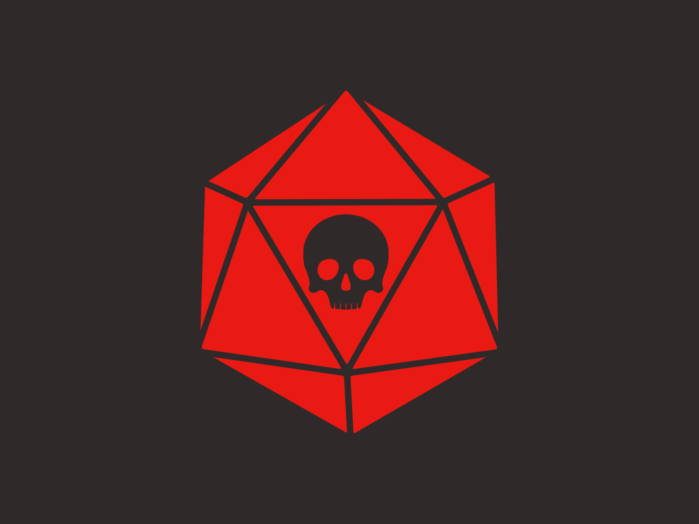

# 🃏 KARDS

**KARDS** es un bot de Discord creado y enfocado para coleccionar e intercambiar cartas digitales diseñadas especialmente como recuerdo para partidas de rol en servidores de Discord. Permite a los usuarios obtener cartas, abrir sobres, ver y comparar colecciones, intercambiar cartas y mucho más, todo de forma interactiva y visual, facilitando la creación de recuerdos únicos de objetos, personajes, lugares y eventos dentro de una campaña de rol.

---

## 📋 Tabla de Contenidos

- [Características](#-características)
- [Crear tu Bot en Discord](#-crear-tu-bot-en-discord)
- [Instalación](#-instalación)
- [Configuración](#-configuración)
- [Comandos](#-comandos)
- [Estructura del Proyecto](#-estructura-del-proyecto)
- [Rarezas y Tipos de Cartas](#-rarezas-y-tipos-de-cartas)
- [Ejemplo de Carta](#-ejemplo-de-carta)
- [Licencia](#-licencia)
- [Créditos](#-créditos)

---

## ✨ Características

- **Colección de cartas**: Cada usuario puede coleccionar cartas de diferentes rarezas y tipos.
- **Apertura de sobres**: Obtén sobres con cartas aleatorias.
- **Intercambio entre usuarios**: Intercambia cartas con otros miembros del servidor de forma segura.
- **Visualización detallada**: Consulta información detallada de cada carta con imágenes y descripciones.
- **Resumen y progreso**: Visualiza tu progreso de colección y qué cartas te faltan.
- **Comparación de colecciones**: Compara tu colección con la de otros usuarios.
- **Paginación interactiva**: Navega fácilmente por colecciones y listas largas usando reacciones.

---

## 🤖 Crear tu Bot en Discord

Antes de la instalación, necesitas crear una aplicación y bot en el [Portal de Desarrolladores de Discord](https://discord.com/developers/applications):

1. **Crea una nueva aplicación:**
   - Ve a [https://discord.com/developers/applications](https://discord.com/developers/applications)
   - Haz clic en **"New Application"** y ponle un nombre (por ejemplo, `KARDS`).

2. **Crea el bot:**
   - Dentro de tu aplicación, ve a la pestaña **"Bot"**.
   - Haz clic en **"Add Bot"** y confirma.

3. **Copia el token del bot:**
   - En la sección **"Bot"**, haz clic en **"Reset Token"** y copia el token.  
     (Lo necesitarás para el archivo `.env` más adelante.)

4. **Dale permisos al bot:**
   - Ve a la pestaña **"OAuth2" > "URL Generator"**.
   - Marca los scopes `bot` y `applications.commands`.
   - En "Bot Permissions", selecciona los permisos necesarios (por ejemplo, `Send Messages`, `Read Message History`, `Add Reactions`, etc.).
   - Copia la URL generada, pégala en tu navegador e invita el bot a tu servidor.

---

## 🚀 Instalación

1. **Clona el repositorio:**
   ```sh
   git clone https://github.com/Kariax/kards.git
   cd kards
   ```

2. **Instala las dependencias:**
   ```sh
   pip install -r requirements.txt
   ```

   > **Nota:** Las dependencias principales son `discord.py` y `python-dotenv`.

3. **Configura el archivo `.env`:**

   Crea un archivo `.env` en la raíz del proyecto con el siguiente contenido:

   ```
   DISCORD_TOKEN=tu_token_de_discord_aquí
   ```

4. **Ejecuta el bot:**
   ```sh
   python bot.py
   ```

---

## ⚙️ Configuración

- **`cartas.json`**: Define todas las cartas disponibles en el juego, sus rarezas, tipos, descripciones e imágenes.
- **`colecciones.json`**: Archivo generado automáticamente para almacenar las colecciones de los usuarios.
- **.env**: Guarda tu token de Discord de forma segura.

---

## 🛠️ Comandos

| Comando | Descripción | Ejemplo |
|---------|-------------|---------|
| `!ping` | Comprueba si el bot está activo. | `!ping` |
| `!coleccion [@usuario]` | Muestra la colección de cartas de un usuario (o la tuya si no mencionas a nadie), con paginación. | `!coleccion`<br>`!coleccion @usuario` |
| `!ver <nombre>` | Muestra información detallada de una carta que posees. | `!ver goblin` |
| `!intercambiar @usuario "mi_carta" "su_carta"` | Propón un intercambio de cartas con otro usuario. | `!intercambiar @Kariax "Goblin" "Lobo"` |
| `!resumen` | Muestra un resumen de tu colección y la distribución de rarezas. | `!resumen` |
| `!falta [@usuario]` | Muestra las cartas que te faltan para completar la colección (o las de otro usuario), con paginación. | `!falta`<br>`!falta @usuario` |
| `!comparar @usuario` | Compara tu colección con la de otro usuario y muestra las diferencias. | `!comparar @usuario` |
| `!help` | Muestra el mensaje de ayuda con todos los comandos. | `!help` |

---

## 🗂️ Estructura del Proyecto

```
Kards/
│
├── bot.py                # Código principal del bot
├── cartas.json           # Base de datos de cartas
├── colecciones.json      # Colecciones de los usuarios (generado automáticamente)
├── .env                  # Variables de entorno (token de Discord)
├── LICENSE               # Licencia del proyecto
├── README.md             # Este archivo
└── resources/
    └── logo/
        ├── kards-high-resolution-banner.png
        ├── kards-high-resolution-logo - square-128px.png
        └── kards-high-resolution-logo.png
```

---

## 🏷️ Rarezas y Tipos de Cartas

| Rareza      | Emoji | Color Discord         |
|-------------|:-----:|----------------------|
| Común       | ⚪    | Gris claro           |
| Rara        | 🔵    | Azul oscuro          |
| Legendaria  | 🟡    | Dorado               |

| Tipo        | Emoji |
|-------------|:-----:|
| Lugar       | 🌍    |
| NPC         | 👤    |
| Evento      | 🎲    |
| Bestiario   | 🐾    |
| Personaje   | 🧙    |
| Objeto      | 🗝️    |

---

## 🖼️ Ejemplo de Carta



> **Nombre:** Goblin  
> **Tipo:** Bestiario 🐾  
> **Rareza:** Común ⚪  
> **Descripción:** Una criatura traviesa y escurridiza.

**Ejemplo en JSON:**

```json
{
  "nombre": "Goblin",
  "tipo": "Bestiario",
  "rareza": "Común",
  "descripcion": "Una criatura traviesa y escurridiza.",
  "imagen": "resources/logo/goblin.png"
}
```

---

## 📄 Licencia

Kards © 2025 by Kariax está licenciado bajo [CC BY-NC-SA 4.0](https://creativecommons.org/licenses/by-nc-sa/4.0/).

---

## 🙌 Créditos

- **Desarrollador principal:** [Kariax](https://github.com/Kariax)
- **Inspiración y comunidad:** Todos los usuarios y testers del servidor de Discord.

---

¿Tienes sugerencias o quieres contribuir? ¡Abre un issue o pull request en GitHub!